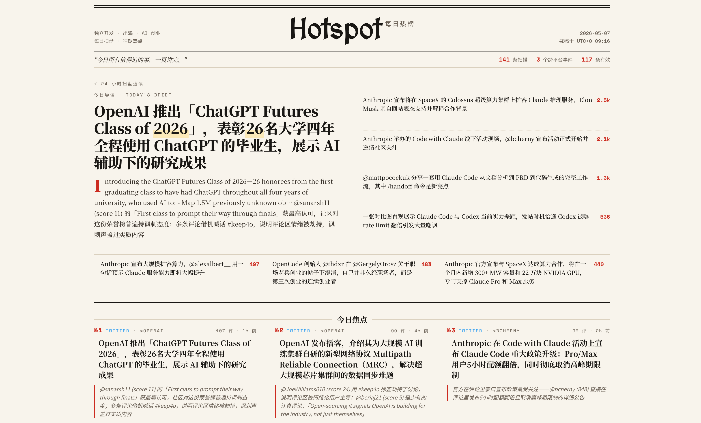

# Hotspot · 每日热榜

> **独立开发 · 出海 · AI 创业**——每天扫遍主流英文技术社区，用 AI 精炼成一张「报纸版」热榜，帮你 10 分钟掌握当日最值得追的事。



**[→ 立即阅读今日热榜](https://hotspot.octohirono.dev/)**

---

## 这是什么

**Hotspot** 是面向独立开发者、AI 创业者和出海从业者的**每日英文技术热点日报**。

每天，一条 AI 流水线自动采集、筛选、深挖数十个高信噪比来源，提炼出当日最具传播力的内容；再由大语言模型标注「这是什么 / 受众关注什么 / 有哪些空白角度」，最终渲染成报纸风格的静态页面。

---

## 每日涵盖

| 板块 | 内容方向 |
|------|----------|
| 跨平台热点 | 同一事件在多个平台同步发酵，AI 聚合后一卡呈现 |
| 行业热点 | AI/ML 前沿动态、独立开发者社区头部创作者的新观点 |
| 实战打法 | 一线 indie hacker 的增长方法、产品策略、变现经验 |
| 话题追踪 | 实时追踪高热技术话题与关键词的讨论温度 |
| 社区热议 | 主流英文技术社区的真实用户声音和需求痛点 |
| 新品 Top | 每日新产品发布排行与早期市场反应 |

---

## 页面功能

- **今日导读**：最热事件的一句话摘要 + 背景阐述
- **今日焦点 TOP 3**：24 小时内互动量最高的三条，附受众关注点解析
- **热度等级**：🔥 / 🔥🔥 / 🔥🔥🔥，基于互动量与跨平台覆盖度自动计算
- **列表 / 表格双视图**：快速浏览或横向比较均可
- **评论证据**：可折叠展开真实评论摘录，验证热度来源
- **往期归档**：历史所有期次均可访问

---

## 技术概述

```
采集 → 筛选 → 详情抓取 → 跨平台事件聚合 → LLM 标注 → 质量校验 → HTML 渲染 → 静态部署
```

- **AI pipeline**：多阶段 Python 脚本 + 并行 LLM 子 agent，每日自动运行
- **跨平台聚合**：IDF 加权信号匹配算法，识别同一事件在不同平台的讨论
- **静态站点**：Node.js 构建，Vercel 部署，全部内容内联到 HTML，无运行时依赖


*每个工作日更新 · 内容覆盖英文技术社区 · AI 标注与聚合*
